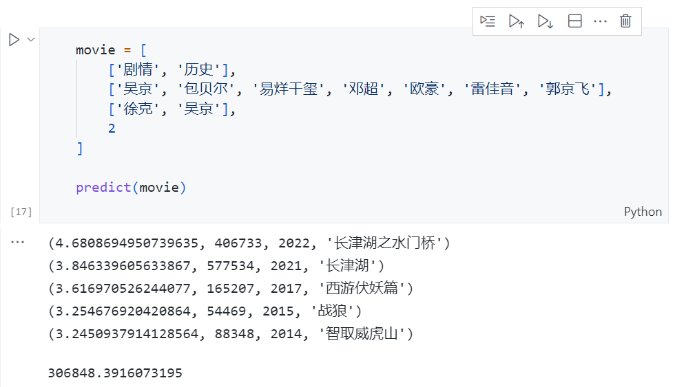
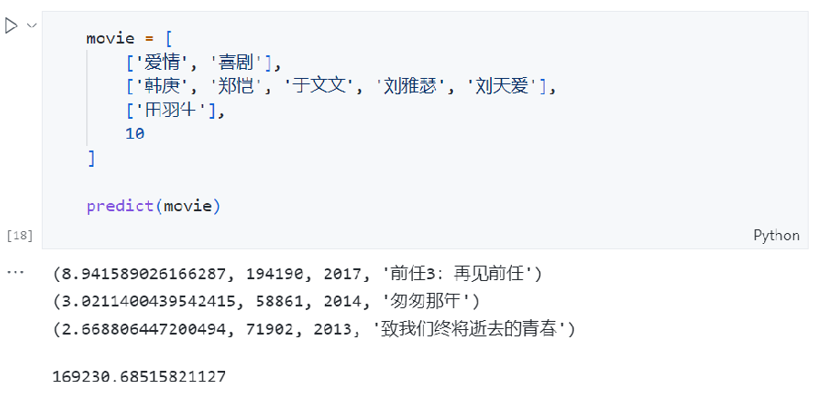

# douban-master

## 功能

数据获取: 使用爬虫工具, 在豆瓣TOP250榜单, 猫眼网票房排行榜上爬取电影相关数据, 如评分,票房等

数据持久化: 使用pandas中的DataFrame存储csv的方式和MySQL关系型数据库存储两种方式分别实现持久化

可视化分析: 从持久化的数据中选取相应数据的关系进行可视化分析

票房预测: 通过可视化分析得到的结论, 选取可能影响票房的因素, 建立预测模型和算法, 进行预测

---
## 文件结构

| 文件                       | 描述                                 |
| -------------------------- | ------------------------------------ |
| main.py                    | 数据爬虫及持久化的主函数             |
| movie_basic.py             | 豆瓣TOP250列表页爬取                 |
| movie_detail.py            | 豆瓣电影详情内页爬取                 |
| database.py                | 数据库连接操作及查询接口             |
| attachfile.py              | 静态内容，如请求头headers等          |
| visualization_sql.ipynb    | 数据可视化，数据使用SQL查询方式      |
| visualization_pandas.ipynb | 数据可视化，数据使用pandas聚合等方式 |
| predict.ipynb              | 票房预测模型的建立和预测举例         |
| /html                      | 存放爬取的html文件                   |
| /csv                       | 存放pandas处理的dataframe数据      |
| /result                    | 存放可视化结果，及数据库内容截图等       |

---

## 技术栈

Python爬虫与数据处理: requests,  lxml,  re,  pandas  

数据持久化: pymysql,  pandas,  MySQL   

数据清洗: pandas,  MySQL (实际上没做)

可视化分析: pyecharts,  matplotlib, SQL,  pandas

模型预测: sklearn,  numpy,  matplotlib

---
## 可视化举例
.png)
.png)
.png)
.png)
.png)
.png)
.png)
.png)
.png)
.png)
.png)

---
## 票房预测举例
单位/万元

