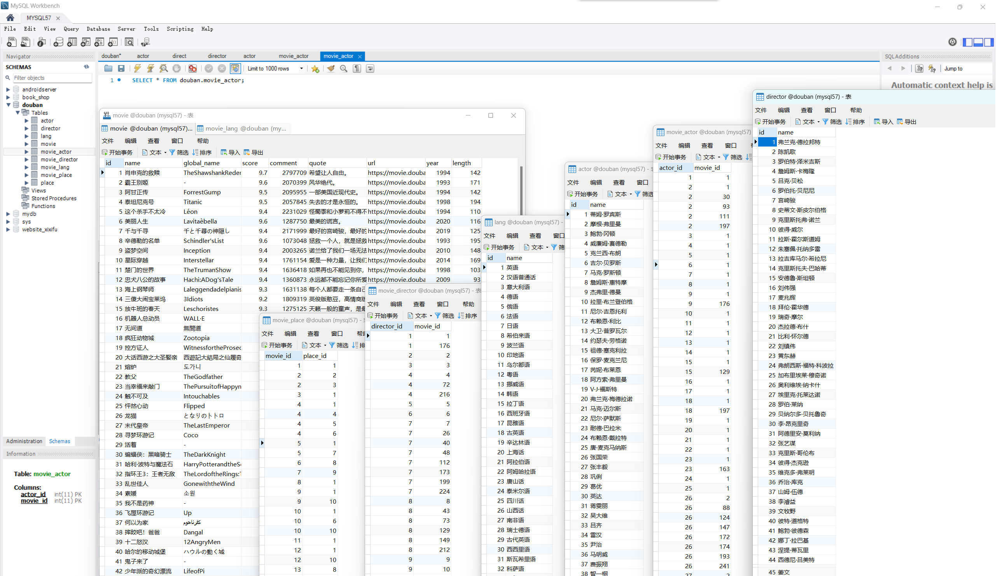

# douban-crawler
 一个爬取豆瓣排行榜数据的python网络爬虫

使用方法: 修改database中的数据库参数, 运行$main.py$

如网络情况比较差或者豆瓣ip限制, 可以将 $html.zip$ 解压到目录下的html文件夹, 并设置 $main.py$ 中 `local_test` 为`True`, 以使用提前爬取的html文件. 

数据库设计: $Report.pdf$ , ddl语句: $douban.sql$

使用效果: 爬取结果保存在 $result.csv$ 文件中, 数据库存储结果如下图:  

